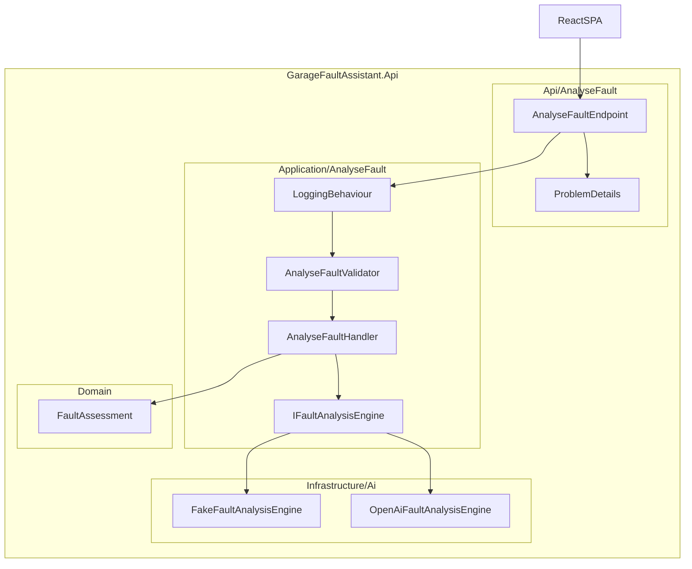
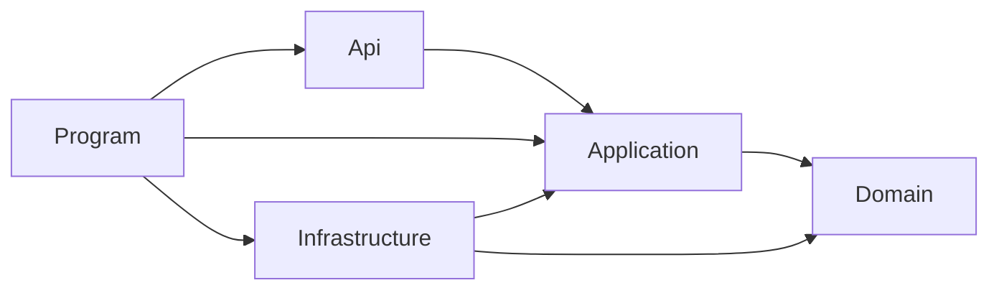

# Design (v1)

**Version:** 1.2  
**Status:** Approved  
**Changelog:** Single project; clean architecture layers as folders; vertical slice in Api + Application.  
**See also:** [Spec.md](../01-spec/spec.md) · [Tasks.md](../04-plans/Tasks.md)

---

## 1. Principles

- Clean architecture: dependencies point inward; layers are **folders**, not separate projects.
- Vertical slicing: one slice per use case spanning `Api/<Feature>/` + `Application/<Feature>/`; v1 = `AnalyseFault`.
- Composition root in `Program.cs` only — wires Application, Infrastructure, endpoints, middleware.
- Ports in Application slice; adapters in Infrastructure.
- Constructor injection; no service locator in handlers.
- Language-model output is untrusted; domain owns safety ([Spec.md](../01-spec/spec.md) §4.3).

---

## 2. Runtime view



### Request pipeline

1. HTTP → endpoint → MediatR (`ISender.Send(AnalyseFaultCommand)`).
2. `LoggingBehaviour` — request name, duration, success/failure; **never** log raw `description` (PII). Log character length only.
3. `ValidationBehaviour` — FluentValidation; failures → `ValidationException`.
4. Handler — `IFaultAnalysisEngine.AnalyseAsync` with `CancellationToken` and timeout policy.
5. Domain factory maps candidate → `FaultAssessment`.
6. Result mapped to HTTP 200.

Endpoint: bind request → `ISender.Send(command)` → map result. No business logic.

---

## 3. Solution layout and layer rules

```
src/
  GarageFaultAssistant.Api/          # single backend csproj — all layers below
    Program.cs
    Api/
      AnalyseFault/
    Application/
      AnalyseFault/
      Common/
    Domain/
    Infrastructure/
tests/
  GarageFaultAssistant.UnitTests/
  GarageFaultAssistant.Api.Tests/
frontend/
```

### Folder layout

```
src/
  GarageFaultAssistant.Api/
    Program.cs
    Api/
      AnalyseFault/
        AnalyseFaultEndpoint.cs
        AnalyseFaultRequest.cs
        AnalyseFaultResponse.cs
    Application/
      AnalyseFault/
        AnalyseFaultCommand.cs
        AnalyseFaultHandler.cs
        AnalyseFaultValidator.cs
        AnalyseFaultMapping.cs
        AnalyseFaultResult.cs
        FaultAnalysisCandidate.cs
        IFaultAnalysisEngine.cs
      Common/
        Behaviours/
          LoggingBehaviour.cs
          ValidationBehaviour.cs
        DependencyInjection/
          ApplicationRegistration.cs
    Domain/
      FaultAssessment.cs
      FaultDescription.cs
      ...
    Infrastructure/
      DependencyInjection/
        InfrastructureRegistration.cs
      Ai/
        FakeFaultAnalysisEngine.cs
        OpenAiFaultAnalysisEngine.cs
        AiOptions.cs
      ExceptionHandling/
        GlobalExceptionHandler.cs
```

### Dependency flow



| Folder | Role | May reference | Must not contain |
|--------|------|---------------|------------------|
| `Domain/` | Entities, value objects, enums, factory, domain exceptions | — | MediatR, ASP.NET, JSON serializers, HTTP, LLM SDKs |
| `Application/<Feature>/` | Commands, handlers, validators, ports, application DTOs | Domain | ASP.NET endpoints, LLM SDKs, `IOptions` binding |
| `Application/Common/` | Shared pipeline behaviours, MediatR registration | Domain, Application features | Feature-specific handlers |
| `Infrastructure/` | Adapters, options binding, external SDKs | Application ports, Domain | HTTP endpoints, domain rules |
| `Api/<Feature>/` | Endpoints, HTTP request/response DTOs | Application (via MediatR) | Business logic, engine implementations |
| `Program.cs` | Composition root | All layers | Business logic |
| Frontend | HTTP API only | — | Direct engine calls |

.NET version: **10**. Frontend: React + TypeScript + Vite.

---

## 4. Analysis engine port

Port lives in `Application/AnalyseFault/`. Adapters live in `Infrastructure/Ai/`.

```csharp
// Application/AnalyseFault/IFaultAnalysisEngine.cs
public interface IFaultAnalysisEngine
{
    Task<FaultAnalysisCandidate> AnalyseAsync(
        string faultDescription,
        CancellationToken cancellationToken);
}
```

`FaultAnalysisCandidate` is an application DTO in `Application/AnalyseFault/` — not a domain entity, not the HTTP contract.

| Adapter | When used | Behaviour |
|---------|-----------|-----------|
| `FakeFaultAnalysisEngine` | Default (`Ai:Provider` = `Fake`) | No network. Keyword + fixture contract in [Tasks.md](../04-plans/Tasks.md). |
| `OpenAiFaultAnalysisEngine` | `Ai:Provider` = `OpenAI` | HTTP to configured OpenAI-compatible endpoint; structured JSON; timeout from options. |

Infrastructure binds `Ai` options. Domain must not reference these types.

If the model returns JSON that cannot bind to `FaultAnalysisCandidate`, treat as analysis rejected (422) or unavailable (503) if the call itself failed — no retries in v1.

Timeout and unavailable paths are **not** produced by the Fake engine. Tests use doubles documented in [Tasks.md](../04-plans/Tasks.md).

---

## 5. DI composition

```csharp
builder.Services.AddApplication();                    // MediatR, validators, pipeline behaviours
builder.Services.AddInfrastructure(builder.Configuration); // engine adapter, Ai options
builder.Services.AddProblemDetails();
builder.Services.AddExceptionHandler<GlobalExceptionHandler>();

// ...

app.MapAnalyseFault();                                // Api/AnalyseFault/AnalyseFaultEndpoint.cs
app.UseExceptionHandler();
```

`AddApplication()` registers handlers and validators from `Application/AnalyseFault/` and behaviours from `Application/Common/`.

Endpoint pattern (thin Api layer):

```csharp
// Api/AnalyseFault/AnalyseFaultEndpoint.cs
public static class AnalyseFaultEndpoint
{
    public static IEndpointRouteBuilder MapAnalyseFault(this IEndpointRouteBuilder app)
    {
        app.MapPost("/api/fault-assessments/analyse",
            async (AnalyseFaultRequest req, ISender sender, CancellationToken ct) =>
            {
                var result = await sender.Send(new AnalyseFaultCommand(req.Description), ct);
                return Results.Ok(AnalyseFaultMapping.ToResponse(result));
            });
        return app;
    }
}
```

Also: structured logging (category + `traceId`). Constructor injection only.

Config keys: [Tasks.md](../04-plans/Tasks.md).
