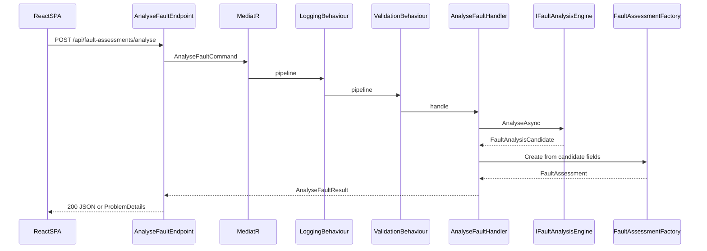
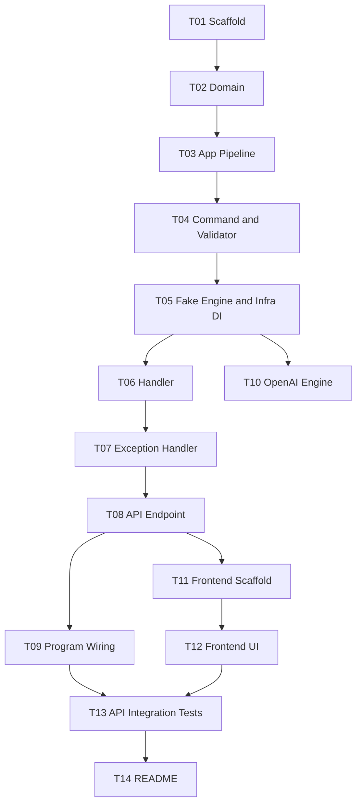

# Implementation Tasks (v1)

**Version:** 1.0  
**Status:** Approved  
**See also:** [Design.md](../03-design/design.md) · [Spec.md](../02-specs/spec.md)

---

## Implementation Overview

This document breaks the approved design into small, independently reviewable tasks. Each task should be developed, tested, reviewed, and checked in as a separate PR whenever practical.

**Approach:** One .NET 10 Web API project (`GarageFaultAssistant.Api`) with clean-architecture folders (not separate projects); one vertical slice (`AnalyseFault`) spanning `Api/` + `Application/`; React SPA in `frontend/`. MediatR orchestrates validation → handler → port; the domain factory enforces safety on untrusted engine output before any HTTP response is produced.

**Major implementation phases:**

1. **Scaffold (T01)** — Solution layout, layer folders, test projects.
2. **Domain + application core (T02–T04)** — Domain model, MediatR pipeline, command/validator/DTOs.
3. **Infrastructure + handler (T05–T06)** — Fake engine, DI, handler with domain mapping.
4. **HTTP pipeline (T07–T09)** — Exception handler, endpoint, `Program.cs` composition.
5. **OpenAI adapter (T10)** — Optional real engine behind config (parallel after T05).
6. **Frontend (T11–T12)** — Vite React SPA and Analyse Fault UI.
7. **Integration + docs (T13–T14)** — API integration tests, README.

**High-level request flow:**



**Design/spec coverage map:**

| Design / spec requirement | Task(s) |
|---------------------------|---------|
| Single csproj, folder layers (`Api/`, `Application/`, `Domain/`, `Infrastructure/`) | T01 |
| Domain types, factory, safety rules (spec §4.3, §5) | T02 |
| MediatR pipeline: LoggingBehaviour (PII-safe), ValidationBehaviour | T03 |
| AnalyseFault command, validator (10–2000 chars), application DTOs | T04 |
| `IFaultAnalysisEngine` port, `FakeFaultAnalysisEngine`, `AiOptions`, Infrastructure DI | T05 |
| Handler: engine call, candidate → domain factory → result | T06 |
| `GlobalExceptionHandler`, RFC 7807 + `traceId` (spec §6) | T07 |
| Thin endpoint `POST /api/fault-assessments/analyse` | T08 |
| `Program.cs` composition root, CORS (Vite dev), structured logging | T09 |
| `OpenAiFaultAnalysisEngine` (structured JSON, timeout, 422/503 paths) | T10 |
| React + TS + Vite SPA, disclaimer, ProblemDetails UI (spec §3, §7) | T11, T12 |
| Unit + integration tests, test doubles for timeout/unavailable | T02–T07, T10, T13 |
| Build/run docs | T14 |

---

## Task Dependency / Execution Order



**Recommended order:** T01 → T02 → T03 → T04 → T05 → T06 → T07 → T08 → T09 → T13 → T14.

**Parallel opportunities:**

- After **T05:** T10 (OpenAI adapter) can proceed in parallel with T07→T09 (HTTP stack).
- After **T08:** T11 (frontend scaffold) can start while T09 finishes.

---

## Task Status Tracking

Each task section below includes a **Status** field. Update both the summary table and the task section when status changes (e.g. when a PR merges).

| Status | Meaning |
|--------|---------|
| `Not Started` | No implementation work begun |
| `In Progress` | Active development or open PR |
| `Complete` | Merged and acceptance criteria met |
| `Blocked` | Cannot proceed — note blocker in the task |
| `Cancelled` | Removed from v1 scope (should remain rare) |

### Task status summary

| Task | Title | Status |
|------|-------|--------|
| T01 | Solution and project scaffold | Complete |
| T02 | Domain layer | Complete |
| T03 | Application pipeline and DI registration | Complete |
| T04 | AnalyseFault command, validator, and application DTOs | Complete |
| T05 | Fake engine, AiOptions, and Infrastructure DI | Complete |
| T06 | AnalyseFault handler and application mapping | Not Started |
| T07 | Global exception handler and ProblemDetails mapping | Not Started |
| T08 | AnalyseFault API endpoint and HTTP DTOs | Not Started |
| T09 | Program.cs composition root | Not Started |
| T10 | OpenAI fault analysis engine adapter | Not Started |
| T11 | Frontend scaffold and API client | Not Started |
| T12 | Frontend Analyse Fault UI | Not Started |
| T13 | API integration tests | Not Started |
| T14 | Build and run documentation | Not Started |

**Progress:** 5 / 14 complete

---

## Appendix A — Ai configuration keys

Consumed by T05, T09, T10.

| Key | Type | Default | Purpose |
|-----|------|---------|---------|
| `Ai:Provider` | string | `Fake` | `Fake` or `OpenAI` |
| `Ai:TimeoutSeconds` | int | `30` | Handler/engine cancellation timeout |
| `Ai:OpenAI:Endpoint` | string | — | OpenAI-compatible chat completions URL |
| `Ai:OpenAI:ApiKey` | string | — | From environment variable or user-secrets in dev |
| `Ai:OpenAI:Model` | string | — | Model id for completions |

**Example `appsettings.json` (no secrets):**

```json
{
  "Ai": {
    "Provider": "Fake",
    "TimeoutSeconds": 30,
    "OpenAI": {
      "Endpoint": "https://api.openai.com/v1/chat/completions",
      "Model": "gpt-4o-mini"
    }
  }
}
```

**Example `appsettings.Development.json`:**

```json
{
  "Ai": {
    "Provider": "Fake"
  }
}
```

Bind API key via `Ai__OpenAI__ApiKey` environment variable or .NET user-secrets when `Provider` is `OpenAI`.

---

## Appendix B — Fake engine fixtures

When `Ai:Provider` is `Fake`, `FakeFaultAnalysisEngine` selects a fixture by keyword match on the trimmed description. **First keyword match wins** (fixtures evaluated top-to-bottom; ordinal case-insensitive substring match).

| Fixture ID | Keywords (any match) | `FaultAnalysisCandidate` fields |
|------------|----------------------|----------------------------------|
| `brakes-critical` | `brake`, `pedal`, `stop` | `CustomerConcern`: "Brake pedal travels to the floor; vehicle does not stop." · `VehicleSystem`: `Brakes` · `Urgency`: `Critical` · `Symptoms`: `["Pedal to floor","No braking"]` · `WorkshopChecks`: `["Inspect brake fluid level and leaks","Check master cylinder"]` · `ClarifyingQuestions`: `["Did any warning light appear?"]` |
| `engine-high` | `engine`, `overheat`, `smoke` | `CustomerConcern`: "Engine overheating with visible smoke." · `VehicleSystem`: `Engine` · `Urgency`: `High` · `Symptoms`: `["Temperature gauge high","Smoke from bonnet"]` · `WorkshopChecks`: `["Check coolant level","Inspect radiator and hoses"]` · `ClarifyingQuestions`: `["How long has the warning been on?"]` |
| `electrical-medium` | `battery`, `electrical`, `light` | `CustomerConcern`: "Electrical issue affecting starting or lights." · `VehicleSystem`: `Electrical` · `Urgency`: `Medium` · `Symptoms`: `["Dim headlights","Slow crank"]` · `WorkshopChecks`: `["Test battery voltage","Inspect alternator belt"]` · `ClarifyingQuestions`: `["Any recent battery replacement?"]` |
| `general-low` | *(default — no keyword match)* | `CustomerConcern`: "General vehicle fault reported by customer." · `VehicleSystem`: `Body` · `Urgency`: `Low` · `Symptoms`: `["Customer reported fault"]` · `WorkshopChecks`: `["Visual inspection","Road test if safe"]` · `ClarifyingQuestions`: `["When did the issue first occur?"]` |

**Domain overlay:** When fixture yields `Brakes` + `Critical`, domain factory adds `safetyWarning`:  
`Safety: treat as potential brake failure — do not drive; inspect before any other work.`  
(spec §4.3 rule 3). Integration tests assert exact HTTP 200 bodies: fixture fields + `safetyWarning` when applicable. JSON must omit `safetyWarning` when not applicable (not `null`).

The Fake engine does **not** simulate timeout or unavailable paths (design §4).

---

## Appendix C — Test engine doubles

Used in unit tests (T06) and integration tests (T13). Live in `tests/GarageFaultAssistant.UnitTests/TestDoubles/` (or similar).

| Double | Behaviour | Used to verify |
|--------|-----------|----------------|
| `ConfigurableFaultAnalysisEngine` | Returns a configured `FaultAnalysisCandidate` | Handler happy path, domain mapping |
| `RejectingFaultAnalysisEngine` | Returns candidate with invalid enum values or empty symptom/check lists | 422 `fault-analysis-rejected` |
| `UnavailableFaultAnalysisEngine` | Throws `AnalysisUnavailableException` | 503 `analysis-unavailable` |
| `TimeoutFaultAnalysisEngine` | Throws `OperationCanceledException` when cancellation token is triggered | 504 `analysis-timeout` |

Register doubles in integration tests via `WebApplicationFactory` `ConfigureTestServices`, replacing `IFaultAnalysisEngine`.

---

## Detailed Tasks

---

## T01 — Solution and project scaffold

### Status

Complete

### 1. Task Title

Solution and project scaffold

### 2. Description

Creates the solution layout defined in design §3: a single backend project containing all architecture layers as folders, two test projects, and a placeholder for the frontend. Establishes the composition-root entry point and empty layer folders so later tasks add code without restructuring.

**Design reference:** design §3 (Solution layout and layer rules).

**System role:** Foundation for all backend and test work; every subsequent task adds files within this structure.

### 3. Implementation Details

- Create `GarageFaultAssistant.sln` at repository root.
- Create `src/GarageFaultAssistant.Api/` as a **.NET 10** (`net10.0`) minimal Web API project (`dotnet new webapi`).
- Create layer folders inside the API project (empty, with optional `.gitkeep`):
  - `Api/AnalyseFault/`
  - `Application/AnalyseFault/`
  - `Application/Common/Behaviours/`
  - `Application/Common/DependencyInjection/`
  - `Domain/`
  - `Infrastructure/Ai/`
  - `Infrastructure/DependencyInjection/`
  - `Infrastructure/ExceptionHandling/`
- Minimal `Program.cs`: build and run Kestrel; optional `GET /health` returning 200 (no business logic).
- Create `tests/GarageFaultAssistant.UnitTests/` — xUnit, references API project.
- Create `tests/GarageFaultAssistant.Api.Tests/` — xUnit + `Microsoft.AspNetCore.Mvc.Testing`, references API project.
- Create `frontend/.gitkeep` (full Vite app deferred to T11).
- Ensure `.gitignore` covers `bin/`, `obj/`, `node_modules/`.

**Main logic:** None — structural only.

**Constraints:** Single csproj for all layers (design §1). No MediatR, domain, or feature code yet.

### 4. Files to Create or Modify

| File | Change | Purpose | Implementation | Logical flow |
|------|--------|---------|----------------|--------------|
| `GarageFaultAssistant.sln` | Create | Solution entry | Add API + both test projects | `dotnet build` entry |
| `src/GarageFaultAssistant.Api/GarageFaultAssistant.Api.csproj` | Create | Backend host | Target `net10.0`, Web SDK | Host project |
| `src/GarageFaultAssistant.Api/Program.cs` | Create | Composition root stub | Minimal pipeline, optional health route | Kestrel startup |
| `src/GarageFaultAssistant.Api/Api/`, `Application/`, `Domain/`, `Infrastructure/` | Create | Layer folders | Empty placeholders | Future layer code |
| `tests/GarageFaultAssistant.UnitTests/GarageFaultAssistant.UnitTests.csproj` | Create | Unit test project | xUnit, project ref to API | Unit test runner |
| `tests/GarageFaultAssistant.UnitTests/SmokeTests.cs` | Create | Build verification | Single `Assert.True(true)` or similar | CI smoke |
| `tests/GarageFaultAssistant.Api.Tests/GarageFaultAssistant.Api.Tests.csproj` | Create | Integration test project | xUnit, Mvc.Testing, project ref | WebApplicationFactory host |
| `frontend/.gitkeep` | Create | Frontend placeholder | Empty until T11 | — |

### 5. Logical Flow

**Build flow:** `dotnet build` → compile API + test projects → success.

**Runtime flow:** `dotnet run --project src/GarageFaultAssistant.Api` → Kestrel listens → optional `GET /health` → 200.

No request pipeline beyond health check.

### 6. Testing and Verification

- `dotnet build` succeeds with zero warnings (or document acceptable warnings).
- `dotnet test` — smoke test passes.
- `dotnet run` — application starts without exception.
- Verify folder structure matches design §3 diagram.

### 7. Acceptance Criteria

- [ ] Solution builds on .NET 10 SDK.
- [ ] Layer folders exist under `src/GarageFaultAssistant.Api/`.
- [ ] Both test projects reference the API project and execute at least one passing test.
- [ ] No domain, MediatR, or AnalyseFault feature code present.
- [ ] Repository remains in a valid, compilable state.

### 8. PR Review Guide

- Confirm single csproj pattern (not multiple layer projects).
- Confirm folder names match design §3 exactly.
- Confirm `Program.cs` contains no business logic.
- Do not expect MediatR, endpoints, or frontend app in this PR.

### 9. Dependencies

| Relationship | Tasks |
|--------------|-------|
| **Requires** | None |
| **Independent** | — |
| **Blocks** | T02–T14 |

### 10. Out of Scope

- Domain model, MediatR, FluentValidation, analysis engine, HTTP analyse endpoint, React app, README.

---

## T02 — Domain layer

### Status

Complete

### 1. Task Title

Domain layer

### 2. Description

Implements the fault-assessment domain from spec §5: enums, value objects, the `FaultAssessment` aggregate, and `FaultAssessmentFactory` enforcing all locked product rules in spec §4.3. The domain layer has no dependencies on Application, Infrastructure, ASP.NET, or MediatR.

**Design reference:** design §3 (Domain folder rules), design §1 (domain owns safety).

**Spec reference:** spec §4.3 (locked rules), §5 (types, enums, exceptions).

**System role:** Central safety and validation gate for untrusted engine output; invoked by the handler (T06) after the analysis engine returns a candidate.

### 3. Implementation Details

**Enums** (spec §5.3):

- `VehicleSystem`: `Engine`, `Electrical`, `Transmission`, `Suspension`, `Brakes`, `Cooling`, `Steering`, `Body`
- `Urgency`: `Low`, `Medium`, `High`, `Critical`

**Value objects** (constructors/factories validate invariants):

- `FaultDescription` — trim; length 10–2000
- `CustomerConcern` — non-empty after trim; max 500 characters
- `Symptom` — non-empty; max 200 characters
- `WorkshopCheck` — non-empty; max 300 characters
- `ClarifyingQuestion` — non-empty; max 300 characters

**Aggregate:**

- `FaultAssessment` — immutable; created only via factory; exposes value objects and enums; optional `SafetyWarning` string

**Factory** (`FaultAssessmentFactory`):

Accept primitive/string inputs (not the Application DTO — Domain must not reference Application). Signature example:

```csharp
public static FaultAssessment Create(
    FaultDescription originalDescription,
    string customerConcern,
    string vehicleSystem,
    string urgency,
    IReadOnlyList<string> symptoms,
    IReadOnlyList<string> workshopChecks,
    IReadOnlyList<string> clarifyingQuestions)
```

Factory behaviour (spec §4.3):

1. Parse `vehicleSystem` and `urgency` case-insensitively; unknown values → throw `FaultAnalysisRejectedException`.
2. Deduplicate symptoms, checks, questions (ordinal ignore-case; keep first occurrence).
3. Reject if symptom or check list is empty after deduplication.
4. Build value objects with length validation.
5. If `VehicleSystem.Brakes` and `Urgency.Critical`, set fixed safety warning string (spec §4.3 rule 3); otherwise no warning.
6. Return `FaultAssessment`.

**Domain exception:**

- `FaultAnalysisRejectedException` — safe, non-technical message for HTTP mapping (T07).

### 4. Files to Create or Modify

| File | Change | Purpose | Implementation | Logical flow |
|------|--------|---------|----------------|--------------|
| `src/.../Domain/VehicleSystem.cs` | Create | Closed enum | 8 values per spec §5.3 | Factory parsing |
| `src/.../Domain/Urgency.cs` | Create | Closed enum | 4 values | Factory parsing |
| `src/.../Domain/FaultDescription.cs` | Create | Input value object | Trim, 10–2000 validation | Factory input |
| `src/.../Domain/CustomerConcern.cs` | Create | Value object | Max 500 | Aggregate field |
| `src/.../Domain/Symptom.cs` | Create | Value object | Max 200 | Aggregate collection |
| `src/.../Domain/WorkshopCheck.cs` | Create | Value object | Max 300 | Aggregate collection |
| `src/.../Domain/ClarifyingQuestion.cs` | Create | Value object | Max 300 | Aggregate collection |
| `src/.../Domain/FaultAssessment.cs` | Create | Aggregate root | Immutable properties | Handler output (via T06) |
| `src/.../Domain/FaultAssessmentFactory.cs` | Create | Factory | All §4.3 rules | Called by handler |
| `src/.../Domain/FaultAnalysisRejectedException.cs` | Create | Domain exception | Safe message | Mapped to 422 in T07 |
| `tests/.../Domain/FaultAssessmentFactoryTests.cs` | Create | Unit tests | All rules + edge cases | Test harness |

### 5. Logical Flow

```
Handler (T06) passes primitive fields from FaultAnalysisCandidate
  → FaultAssessmentFactory.Create(...)
    → Parse enums (fail → FaultAnalysisRejectedException)
    → Dedupe lists
    → Validate non-empty symptoms/checks
    → Create value objects
    → Apply Brakes+Critical safety rule
  → FaultAssessment
```

**Error flow:** Any invariant violation → `FaultAnalysisRejectedException` (no HTTP knowledge).

### 6. Testing and Verification

**Unit tests (`FaultAssessmentFactoryTests`):**

| Case | Expected |
|------|----------|
| Valid candidate fields | `FaultAssessment` with correct properties |
| Unknown `vehicleSystem` string | `FaultAnalysisRejectedException` |
| Unknown `urgency` string | `FaultAnalysisRejectedException` |
| Duplicate symptoms (ignore-case) | First kept, rest dropped |
| Empty symptoms after dedupe | Rejected |
| Empty workshop checks after dedupe | Rejected |
| Brakes + Critical | Safety warning present with exact spec string |
| Engine + Critical (or Brakes + High) | No safety warning |
| `CustomerConcern` over 500 chars | Rejected |
| Clarifying questions may be empty list | Allowed (spec §4.2) |

**Manual:** `dotnet test tests/GarageFaultAssistant.UnitTests`.

### 7. Acceptance Criteria

- [ ] Domain folder contains no references to MediatR, ASP.NET, FluentValidation, or Infrastructure.
- [ ] All spec §4.3 rules enforced in factory with unit test coverage.
- [ ] Enums match spec §5.3 exactly (no `UnknownSystem`).
- [ ] Safety warning text matches spec §4.3 rule 3 verbatim.
- [ ] All unit tests pass.

### 8. PR Review Guide

- Verify Domain has zero outward dependencies (check csproj/usings).
- Walk through factory logic against spec §4.3 checklist.
- Confirm factory does not accept Application-layer types.
- Do not expect HTTP, MediatR, or engine code.

### 9. Dependencies

| Relationship | Tasks |
|--------------|-------|
| **Requires** | T01 |
| **Independent** | Can proceed without T03/T04 (factory tests use primitives) |
| **Blocks** | T06 |

### 10. Out of Scope

- FluentValidation for HTTP input (T04), analysis engine (T05), HTTP mapping (T07–T08), `FaultAnalysisCandidate` Application DTO (T04).

---

## T03 — Application pipeline and DI registration

### Status

Complete

### 1. Task Title

Application pipeline and DI registration

### 2. Description

Implements MediatR pipeline behaviours and `AddApplication()` from design §2 (request pipeline steps 2–3) and design §5. Registers cross-cutting logging and validation behaviours that wrap every command handler.

**Design reference:** design §2 (LoggingBehaviour, ValidationBehaviour), design §5 (`AddApplication()`).

**System role:** Cross-cutting pipeline executed before any handler; ensures PII-safe logging and FluentValidation for all commands.

### 3. Implementation Details

**Packages:** MediatR, FluentValidation, FluentValidation.DependencyInjectionExtensions.

**`ApplicationRegistration.AddApplication(IServiceCollection services)`:**

- Register MediatR handlers from `Application/AnalyseFault` assembly (handler added in T06).
- Register FluentValidation validators from same assembly (validator added in T04).
- Register open generic behaviours:
  - `LoggingBehaviour<TRequest,TResponse>` — outer pipeline
  - `ValidationBehaviour<TRequest,TResponse>` — inner pipeline (before handler)

**`LoggingBehaviour`:**

- Log: request type name, elapsed ms, success or failure status.
- For `AnalyseFaultCommand`: log **description character length only** — never raw description text (design §2, PII).
- Use structured logging (`ILogger<T>`).

**`ValidationBehaviour`:**

- Resolve `IEnumerable<IValidator<TRequest>>` from DI.
- Run all validators; aggregate failures.
- Throw `ValidationException` on any failure (mapped to 400 in T07).

**Pipeline order:** Logging → Validation → Handler (MediatR behaviour ordering: register ValidationBehaviour first so it runs closer to handler, LoggingBehaviour second as outer wrapper — verify with MediatR `IPipelineBehavior` registration order).

### 4. Files to Create or Modify

| File | Change | Purpose | Implementation | Logical flow |
|------|--------|---------|----------------|--------------|
| `Application/Common/DependencyInjection/ApplicationRegistration.cs` | Create | DI extension | `AddApplication()` | Called from Program.cs (T09) |
| `Application/Common/Behaviours/LoggingBehaviour.cs` | Create | PII-safe logging | Duration + length only | Outermost pipeline |
| `Application/Common/Behaviours/ValidationBehaviour.cs` | Create | FluentValidation runner | Throws ValidationException | Pre-handler |
| `src/.../GarageFaultAssistant.Api.csproj` | Modify | Package refs | MediatR, FluentValidation | Build |
| `tests/.../Application/LoggingBehaviourTests.cs` | Create | Logging tests | Assert no PII in logs | Test harness |
| `tests/.../Application/ValidationBehaviourTests.cs` | Create | Validation tests | Invalid request → exception | Test harness |

### 5. Logical Flow

```
ISender.Send(command)
  → LoggingBehaviour: start timer, log request name
    → ValidationBehaviour: run IValidator<T>
      → (handler — T06)
    → ValidationBehaviour: propagate or throw
  → LoggingBehaviour: log duration + success/failure + description length (if AnalyseFault)
```

**Error flow:** Validation failure → `ValidationException` bubbles out (not caught here).

### 6. Testing and Verification

- **LoggingBehaviour:** Send test command with known description; capture log output; assert description text absent, length present.
- **ValidationBehaviour:** Register test validator rejecting input; assert `ValidationException` with correct errors.
- **Registration:** `AddApplication()` does not throw; services resolve.

Use test doubles (simple `IRequest`/`IRequestHandler` pairs) — do not require T04 types if testing in isolation.

### 7. Acceptance Criteria

- [ ] `AddApplication()` registers MediatR and both behaviours.
- [ ] Logging never writes raw fault description content.
- [ ] Validation failures throw `ValidationException`.
- [ ] Unit tests pass.
- [ ] Solution builds (handler registration optional until T06 — use empty handler assembly or defer handler test to T06).

### 8. PR Review Guide

- Focus on behaviour ordering and PII logging rule.
- Confirm no ASP.NET types in Application/Common (except none expected).
- Do not expect AnalyseFault handler, endpoint, or exception HTTP mapping.

### 9. Dependencies

| Relationship | Tasks |
|--------------|-------|
| **Requires** | T01 |
| **Blocks** | T04, T06 |
| **Independent of** | T02 (domain) |

### 10. Out of Scope

- `AnalyseFaultHandler`, `AnalyseFaultValidator` implementation (T04), HTTP exception mapping (T07), `Program.cs` wiring (T09).

---

## T04 — AnalyseFault command, validator, and application DTOs

### Status

Complete

### 1. Task Title

AnalyseFault command, validator, and application DTOs

### 2. Description

Creates the Application-layer artefacts for the AnalyseFault vertical slice: command, FluentValidation validator, untrusted engine DTO, result DTO, and the analysis engine port interface. No handler or HTTP types yet.

**Design reference:** design §3 (Application/AnalyseFault folder), design §4 (port and `FaultAnalysisCandidate`).

**Spec reference:** spec §4.1 (input rules), §4.2 (output shape), §5.2 (`FaultAnalysisCandidate` as application DTO).

**System role:** Defines the application contract between API/handler and analysis engine; validator enforces HTTP input rules before handler runs.

### 3. Implementation Details

**`AnalyseFaultCommand`:**

```csharp
public record AnalyseFaultCommand(string Description) : IRequest<AnalyseFaultResult>;
```

**`AnalyseFaultValidator`:**

- `Description`: NotEmpty, trim applied in rule, length 10–2000 inclusive after trim (spec §4.1).

**`FaultAnalysisCandidate`** (untrusted engine output — not domain, not HTTP):

- `CustomerConcern` (string)
- `VehicleSystem` (string)
- `Urgency` (string)
- `Symptoms` (List/string array)
- `WorkshopChecks` (List/string array)
- `ClarifyingQuestions` (List/string array)

**`AnalyseFaultResult`** (application success model):

- Mirrors spec §4.2 fields: `CustomerConcern`, `VehicleSystem`, `Urgency`, `Symptoms`, `WorkshopChecks`, `ClarifyingQuestions`, optional `SafetyWarning`.

**`IFaultAnalysisEngine`** (design §4):

```csharp
public interface IFaultAnalysisEngine
{
    Task<FaultAnalysisCandidate> AnalyseAsync(
        string faultDescription,
        CancellationToken cancellationToken);
}
```

### 4. Files to Create or Modify

| File | Change | Purpose | Implementation | Logical flow |
|------|--------|---------|----------------|--------------|
| `Application/AnalyseFault/AnalyseFaultCommand.cs` | Create | MediatR command | IRequest<AnalyseFaultResult> | Endpoint → MediatR |
| `Application/AnalyseFault/AnalyseFaultValidator.cs` | Create | Input validation | FluentValidation rules | ValidationBehaviour |
| `Application/AnalyseFault/FaultAnalysisCandidate.cs` | Create | Engine output DTO | Untrusted shape | Engine → Handler |
| `Application/AnalyseFault/AnalyseFaultResult.cs` | Create | Handler result | Success fields | Handler → API mapping |
| `Application/AnalyseFault/IFaultAnalysisEngine.cs` | Create | Port | Single AnalyseAsync | Handler → Infrastructure |
| `tests/.../Application/AnalyseFaultValidatorTests.cs` | Create | Validator tests | Boundary cases | Test harness |

### 5. Logical Flow

```
AnalyseFaultCommand enters pipeline (T03)
  → AnalyseFaultValidator validates Description
  → (handler T06 will call IFaultAnalysisEngine — not in this task)
```

### 6. Testing and Verification

**`AnalyseFaultValidatorTests`:**

| Input | Expected |
|-------|----------|
| null / empty / whitespace-only | Invalid |
| 9 chars after trim | Invalid |
| 10 chars after trim | Valid |
| 2000 chars | Valid |
| 2001 chars | Invalid |
| Leading/trailing whitespace trimmed for length check | Valid/invalid per trimmed length |

### 7. Acceptance Criteria

- [ ] Validator rules match spec §4.1 exactly.
- [ ] Port interface matches design §4 signature.
- [ ] `FaultAnalysisCandidate` is in Application, not Domain or Api.
- [ ] No handler, engine implementation, or HTTP DTOs in this PR.
- [ ] All validator unit tests pass.

### 8. PR Review Guide

- Confirm Application layer does not reference Infrastructure or ASP.NET.
- Verify validator trim semantics match spec ("after trim").
- Do not expect handler, Fake engine, or endpoint.

### 9. Dependencies

| Relationship | Tasks |
|--------------|-------|
| **Requires** | T03 |
| **Blocks** | T05, T06 |
| **Independent of** | T02 |

### 10. Out of Scope

- Handler, engine adapters, HTTP request/response DTOs, domain factory, exception mapping.

---

## T05 — Fake engine, AiOptions, and Infrastructure DI

### Status

Complete

### 1. Task Title

Fake engine, AiOptions, and Infrastructure DI

### 2. Description

Implements the default analysis engine adapter and Infrastructure DI registration. Defines the Fake fixture contract (Appendix B) and Ai configuration binding (Appendix A). Enables local/demo use without network or API keys.

**Design reference:** design §4 (Fake adapter, default provider), design §5 (InfrastructureRegistration).

**Spec reference:** spec §2.1 (run without API key), spec §6 (Fake 200 bodies match fixtures).

**System role:** Default `IFaultAnalysisEngine` implementation; selected by `Ai:Provider=Fake`.

### 3. Implementation Details

**`AiOptions`:**

- Bind section `Ai` from configuration (Appendix A).
- Validate on startup: `Provider` must be `Fake` or `OpenAI`; `TimeoutSeconds` > 0.
- When `Provider=OpenAI`, require `Endpoint`, `ApiKey`, `Model` (OpenAI adapter implemented in T10 — until then, either fail startup with clear message or register stub that throws `NotImplementedException`).

**`FakeFaultAnalysisEngine`:**

- Implement `IFaultAnalysisEngine`.
- Match description against fixture keywords (Appendix B); first match wins.
- Return `FaultAnalysisCandidate` with exact fixture field values.
- No network I/O; no delay; no timeout/unavailable simulation.

**`InfrastructureRegistration.AddInfrastructure(IConfiguration)`:**

- `services.Configure<AiOptions>(configuration.GetSection("Ai"))`
- Register `IFaultAnalysisEngine`:
  - `Fake` → `FakeFaultAnalysisEngine` (singleton or scoped)
  - `OpenAI` → defer to T10 (stub acceptable until T10 merges)
- Unknown provider → throw at startup with clear error.

### 4. Files to Create or Modify

| File | Change | Purpose | Implementation | Logical flow |
|------|--------|---------|----------------|--------------|
| `Infrastructure/Ai/AiOptions.cs` | Create | Config model | Provider, Timeout, OpenAI nested | DI binding |
| `Infrastructure/Ai/OpenAiOptions.cs` | Create | Nested config | Endpoint, ApiKey, Model | OpenAI adapter (T10) |
| `Infrastructure/Ai/FakeFaultAnalysisEngine.cs` | Create | Fake adapter | Keyword → fixture | Handler engine call |
| `Infrastructure/DependencyInjection/InfrastructureRegistration.cs` | Create | DI extension | `AddInfrastructure()` | Program.cs (T09) |
| `appsettings.json` | Create | Default config | Provider Fake, timeout 30 | Host config |
| `tests/.../Infrastructure/FakeFaultAnalysisEngineTests.cs` | Create | Fixture tests | All keywords + default | Test harness |

### 5. Logical Flow

```
DI container resolves IFaultAnalysisEngine
  → FakeFaultAnalysisEngine.AnalyseAsync(description, ct)
    → Trim description
    → Evaluate fixture keywords (Appendix B order)
    → Build FaultAnalysisCandidate from matched fixture
  → Return to handler (T06)
```

### 6. Testing and Verification

- Each fixture ID triggered by at least one keyword.
- Default fixture when no keyword matches.
- Case-insensitive keyword matching.
- Candidate field values match Appendix B exactly.
- No HTTP client usage in Fake engine.

### 7. Acceptance Criteria

- [ ] Default configuration uses Fake provider.
- [ ] All four fixtures implemented per Appendix B.
- [ ] `AddInfrastructure()` registers engine based on config.
- [ ] Unit tests pass.
- [ ] Solution builds with Infrastructure referencing Application port only.

### 8. PR Review Guide

- Verify fixture text matches Appendix B verbatim (integration tests depend on this).
- Confirm Infrastructure does not contain domain rules or HTTP endpoints.
- OpenAI registration may be stubbed — full adapter is T10.
- Do not expect handler or HTTP pipeline.

### 9. Dependencies

| Relationship | Tasks |
|--------------|-------|
| **Requires** | T04 (`IFaultAnalysisEngine`, `FaultAnalysisCandidate`) |
| **Blocks** | T06, T09, T13 |
| **Parallel after completion** | T10 |

### 10. Out of Scope

- OpenAI HTTP implementation (T10), handler/domain mapping (T06), timeout/unavailable in Fake engine, `Program.cs` wiring (T09).

---

## T06 — AnalyseFault handler and application mapping

### Status

Not Started

### 1. Task Title

AnalyseFault handler and application mapping

### 2. Description

Implements the core use case orchestration from design §2 steps 4–5: invoke the analysis engine, map untrusted candidate through the domain factory, return `AnalyseFaultResult`. Applies timeout policy and translates engine failures to application exceptions for HTTP mapping.

**Design reference:** design §2 (handler, domain factory, timeout).

**Spec reference:** spec §4.3 (domain rules via factory), spec §5.2 (mapping chain).

**System role:** Central orchestrator of the AnalyseFault use case; only Application code that calls both the port and domain factory.

### 3. Implementation Details

**`AnalyseFaultHandler`:**

- Inject: `IFaultAnalysisEngine`, `IOptions<AiOptions>`, `ILogger<AnalyseFaultHandler>` (optional).
- Create linked `CancellationTokenSource` from request token + `Ai:TimeoutSeconds`.
- Call `engine.AnalyseAsync(command.Description, linkedToken)`.
- On `OperationCanceledException` when timeout fires → throw `AnalysisTimeoutException`.
- On engine/infrastructure failures → throw `AnalysisUnavailableException` (defined in Application or Infrastructure, mapped in T07).
- Map candidate to factory inputs; call `FaultAssessmentFactory.Create(...)`.
- Catch `FaultAnalysisRejectedException` — rethrow (mapped to 422 in T07).
- Map `FaultAssessment` → `AnalyseFaultResult` via `AnalyseFaultMapping.ToResult`.

**Application exceptions (if not in prior tasks):**

- `AnalysisUnavailableException`
- `AnalysisTimeoutException`

**`AnalyseFaultMapping.ToResult(FaultAssessment)`:**

- Explicit property mapping; enum to string for result fields.

### 4. Files to Create or Modify

| File | Change | Purpose | Implementation | Logical flow |
|------|--------|---------|----------------|--------------|
| `Application/AnalyseFault/AnalyseFaultHandler.cs` | Create | Use case handler | Engine + factory + map | MediatR handler |
| `Application/AnalyseFault/AnalyseFaultMapping.cs` | Create | Domain → result map | ToResult | Handler → endpoint |
| `Application/AnalyseFault/AnalysisUnavailableException.cs` | Create | 503 signal | Safe exception | T07 mapping |
| `Application/AnalyseFault/AnalysisTimeoutException.cs` | Create | 504 signal | Safe exception | T07 mapping |
| `tests/.../TestDoubles/ConfigurableFaultAnalysisEngine.cs` | Create | Test double | Appendix C | Handler tests |
| `tests/.../TestDoubles/RejectingFaultAnalysisEngine.cs` | Create | Test double | Invalid candidate | 422 tests |
| `tests/.../TestDoubles/UnavailableFaultAnalysisEngine.cs` | Create | Test double | Throws unavailable | 503 tests |
| `tests/.../TestDoubles/TimeoutFaultAnalysisEngine.cs` | Create | Test double | Cancellation | 504 tests |
| `tests/.../Application/AnalyseFaultHandlerTests.cs` | Create | Handler tests | All paths | Test harness |

### 5. Logical Flow

```
AnalyseFaultHandler.Handle(command)
  → Create timeout-linked CancellationToken
  → IFaultAnalysisEngine.AnalyseAsync(description, token)
    → (timeout) → AnalysisTimeoutException
    → (unavailable) → AnalysisUnavailableException
  → FaultAssessmentFactory.Create(description, candidate fields...)
    → (rejected) → FaultAnalysisRejectedException
  → AnalyseFaultMapping.ToResult(assessment)
  → AnalyseFaultResult
```

### 6. Testing and Verification

| Scenario | Engine double | Expected |
|----------|---------------|----------|
| Happy path | ConfigurableFaultAnalysisEngine | Valid AnalyseFaultResult |
| Invalid enum / empty lists | RejectingFaultAnalysisEngine | FaultAnalysisRejectedException |
| Engine down | UnavailableFaultAnalysisEngine | AnalysisUnavailableException |
| Timeout | TimeoutFaultAnalysisEngine or short timeout | AnalysisTimeoutException |
| Brakes + Critical candidate | Configurable with fixture values | Result includes safety warning |

Use MediatR `ISender` in tests or invoke handler directly with mocked engine.

### 7. Acceptance Criteria

- [ ] Handler registered and discovered by `AddApplication()`.
- [ ] Timeout uses `Ai:TimeoutSeconds` from options.
- [ ] Domain factory invoked for all successful engine responses.
- [ ] No ASP.NET or HTTP types in handler.
- [ ] All handler unit tests pass.

### 8. PR Review Guide

- Trace happy path and each exception path.
- Confirm handler does not log raw description (delegated to LoggingBehaviour).
- Verify factory receives primitive fields, not Application DTO inside Domain.
- Do not expect HTTP endpoint or ProblemDetails mapping.

### 9. Dependencies

| Relationship | Tasks |
|--------------|-------|
| **Requires** | T02, T04, T05 |
| **Blocks** | T07, T08 |

### 10. Out of Scope

- HTTP response mapping (T08), GlobalExceptionHandler (T07), OpenAI adapter internals (T10), integration tests (T13).

---

## T07 — Global exception handler and ProblemDetails mapping

### Status

Not Started

### 1. Task Title

Global exception handler and ProblemDetails mapping

### 2. Description

Implements RFC 7807 error responses per spec §6. Maps exceptions from validation, domain, and engine layers to stable HTTP status codes and ProblemDetails bodies with `traceId`. Prevents leakage of stack traces and engine payloads.

**Design reference:** design §5 (`AddExceptionHandler`, `AddProblemDetails`).

**Spec reference:** spec §6 (error table).

**System role:** Single HTTP error translation point for all unhandled exceptions from the analyse pipeline.

### 3. Implementation Details

**`GlobalExceptionHandler` : `IExceptionHandler`:**

| Exception | Status | Type | Body |
|-----------|--------|------|------|
| `ValidationException` | 400 | `validation` | `ValidationProblemDetails` with `errors` keyed by field |
| `FaultAnalysisRejectedException` | 422 | `fault-analysis-rejected` | `title`, `detail` (safe message) |
| `AnalysisUnavailableException` | 503 | `analysis-unavailable` | `title`, `detail` |
| `AnalysisTimeoutException` or timeout `OperationCanceledException` | 504 | `analysis-timeout` | `title`, `detail` |
| All others | 500 | `internal` | Generic detail; `traceId` only |

- Add `traceId` to ProblemDetails `extensions` for all responses (use `Activity.Current?.Id` or `HttpContext.TraceIdentifier`).
- Do not include stack traces, inner exceptions, or raw engine JSON in responses.
- Use stable type URIs (e.g. `https://garagefault.app/problems/validation` or fragment `#validation` — pick one convention and document).

### 4. Files to Create or Modify

| File | Change | Purpose | Implementation | Logical flow |
|------|--------|---------|----------------|--------------|
| `Infrastructure/ExceptionHandling/GlobalExceptionHandler.cs` | Create | IExceptionHandler | Map all exception types | Middleware pipeline |
| `tests/.../Infrastructure/GlobalExceptionHandlerTests.cs` | Create | Mapping tests | Each status/type | Test harness |

### 5. Logical Flow

```
Exception thrown in endpoint/MediatR/handler
  → ASP.NET exception middleware
  → GlobalExceptionHandler.TryHandleAsync
    → Identify exception type
    → Build ProblemDetails + status code
    → Write JSON response with traceId
```

### 6. Testing and Verification

- Unit test each exception type → expected status, `type`, safe `detail`, `traceId` in extensions.
- Assert 500 response does not contain exception message from unhandled exceptions.
- Assert 422/503/504 details are user-safe (no stack trace substrings).

### 7. Acceptance Criteria

- [ ] All spec §6 error rows implemented.
- [ ] Every error response includes `traceId` in extensions.
- [ ] No engine payload or stack trace in any response body.
- [ ] Unit tests pass.

### 8. PR Review Guide

- Walk spec §6 table row-by-row against handler code.
- Confirm ValidationProblemDetails shape for 400 (field errors).
- Do not expect endpoint registration or CORS (T09).

### 9. Dependencies

| Relationship | Tasks |
|--------------|-------|
| **Requires** | T06 (exceptions thrown by handler) |
| **Blocks** | T08, T09 |

### 10. Out of Scope

- Endpoint definition (T08), CORS, frontend error UI (T12), `Program.cs` registration (T09 — may add registration in T07 or T09; prefer T09 for composition).

---

## T08 — AnalyseFault API endpoint and HTTP DTOs

### Status

Not Started

### 1. Task Title

AnalyseFault API endpoint and HTTP DTOs

### 2. Description

Implements the thin Api layer from design §5: HTTP request/response DTOs, minimal endpoint mapping POST to MediatR, and response mapping. No business logic in the endpoint.

**Design reference:** design §5 (endpoint pattern snippet).

**Spec reference:** spec §6 (HTTP contract, JSON field names, omit null safetyWarning).

**System role:** HTTP entry point for the AnalyseFault use case; translates JSON ↔ application types.

### 3. Implementation Details

**`AnalyseFaultRequest`:**

- `Description` property (JSON `description` via camelCase naming policy).

**`AnalyseFaultResponse`:**

- Properties matching spec §4.2 camelCase JSON names.
- `SafetyWarning`: annotate with `[JsonIgnore(Condition = JsonIgnoreCondition.WhenWritingNull)]` so omitted when null.

**`AnalyseFaultEndpoint.MapAnalyseFault()`:**

- `POST /api/fault-assessments/analyse`
- Bind body → `AnalyseFaultRequest`
- `await sender.Send(new AnalyseFaultCommand(req.Description), ct)`
- `Results.Ok(AnalyseFaultMapping.ToResponse(result))`
- Match design §5 snippet exactly (no extra logic).

**`AnalyseFaultMapping.ToResponse(AnalyseFaultResult)`:**

- Map to `AnalyseFaultResponse`; enum strings as returned in result.

**Temporary wiring for local testing:** Optionally call `MapAnalyseFault()` from `Program.cs` in this task, or leave for T09 (document which — prefer T09 for composition; T08 may add minimal Map call for manual test if needed without full DI).

### 4. Files to Create or Modify

| File | Change | Purpose | Implementation | Logical flow |
|------|--------|---------|----------------|--------------|
| `Api/AnalyseFault/AnalyseFaultRequest.cs` | Create | HTTP request DTO | description field | Deserialization |
| `Api/AnalyseFault/AnalyseFaultResponse.cs` | Create | HTTP response DTO | Omit null safetyWarning | Serialization |
| `Api/AnalyseFault/AnalyseFaultEndpoint.cs` | Create | Route mapping | MapPost + ISender | HTTP entry |
| `Application/AnalyseFault/AnalyseFaultMapping.cs` | Modify | Add ToResponse | Result → HTTP DTO | Endpoint response |
| `tests/.../Application/AnalyseFaultMappingTests.cs` | Create | Mapping tests | ToResponse omit null | Test harness |

### 5. Logical Flow

```
POST /api/fault-assessments/analyse
  → Bind AnalyseFaultRequest
  → ISender.Send(AnalyseFaultCommand)
  → (MediatR pipeline — T03, T06)
  → AnalyseFaultMapping.ToResponse(result)
  → 200 OK JSON
```

**Error flow:** Exceptions propagate to GlobalExceptionHandler (T07) — not caught in endpoint.

### 6. Testing and Verification

- Unit test `ToResponse`: when `SafetyWarning` is null, serialized JSON omits property.
- Unit test `ToResponse`: all fields mapped correctly.
- Full HTTP tests deferred to T13 (endpoint may not be wired until T09).

### 7. Acceptance Criteria

- [ ] Route path matches spec §6 exactly.
- [ ] JSON property names match spec §6 (camelCase).
- [ ] Endpoint contains no business logic (no validation beyond model binding, no engine calls).
- [ ] Mapping tests pass.

### 8. PR Review Guide

- Compare endpoint code to design §5 snippet line-by-line.
- Confirm Api layer only references Application via MediatR and mapping.
- Full E2E HTTP tests are T13, not this PR.

### 9. Dependencies

| Relationship | Tasks |
|--------------|-------|
| **Requires** | T06, T07 |
| **Blocks** | T09, T11, T13 |

### 10. Out of Scope

- Full `Program.cs` composition (T09), CORS, frontend, integration tests.

---

## T09 — Program.cs composition root

### Status

Not Started

### 1. Task Title

Program.cs composition root

### 2. Description

Wires the full application per design §5: Application and Infrastructure DI, ProblemDetails, global exception handler, endpoint mapping, Development CORS for Vite, and structured logging with trace correlation.

**Design reference:** design §5 (DI composition snippet).

**Spec reference:** spec §6 (CORS for Vite dev origin).

**System role:** Sole composition root — the only place all layers are wired together.

### 3. Implementation Details

**`Program.cs`:**

```csharp
builder.Services.AddApplication();
builder.Services.AddInfrastructure(builder.Configuration);
builder.Services.AddProblemDetails();
builder.Services.AddExceptionHandler<GlobalExceptionHandler>();

// Development CORS for Vite
if (builder.Environment.IsDevelopment())
{
    builder.Services.AddCors(/* allow http://localhost:5173 */);
}

var app = builder.Build();
app.UseExceptionHandler();
if (app.Environment.IsDevelopment()) app.UseCors(/* policy */);
app.MapAnalyseFault();
app.Run();
```

**Configuration files:**

- `appsettings.json` — Ai section per Appendix A (Fake default).
- `appsettings.Development.json` — Provider Fake, logging levels.

**Logging:**

- Use built-in structured logging; ensure `traceId` available for ProblemDetails (align with T07).

### 4. Files to Create or Modify

| File | Change | Purpose | Implementation | Logical flow |
|------|--------|---------|----------------|--------------|
| `src/.../Program.cs` | Modify | Composition root | Full DI + middleware | App startup |
| `appsettings.json` | Modify/Create | Production config | Ai defaults | Config binding |
| `appsettings.Development.json` | Create | Dev config | Fake provider, CORS | Local dev |
| `Properties/launchSettings.json` | Create | Dev URLs | Kestrel ports | Local run |

### 5. Logical Flow

**Startup:** Configure services → build app → exception handler → CORS (dev) → map endpoint → run.

**Request (success):** HTTP → endpoint → MediatR → handler → 200.

**Request (failure):** HTTP → endpoint → MediatR → exception → GlobalExceptionHandler → ProblemDetails.

### 6. Testing and Verification

- Manual: `dotnet run`, POST valid description with Fake provider → 200.
- Manual: POST invalid description (too short) → 400 ProblemDetails with field errors.
- Manual: Verify CORS headers for `Origin: http://localhost:5173` in Development.
- Manual: Brakes keyword description → 200 with `safetyWarning`.

### 7. Acceptance Criteria

- [ ] Application starts without configuration errors (Fake provider).
- [ ] `POST /api/fault-assessments/analyse` reachable and returns 200 for valid input.
- [ ] Exception handler active (400 on validation failure).
- [ ] Development CORS allows Vite origin.
- [ ] No business logic in Program.cs beyond wiring.

### 8. PR Review Guide

- Compare wiring to design §5 snippet.
- Confirm middleware order: exception handler before endpoints.
- OpenAI provider may require T10 for full functionality — Fake must work.
- Frontend and README not in this PR.

### 9. Dependencies

| Relationship | Tasks |
|--------------|-------|
| **Requires** | T05, T07, T08 |
| **Blocks** | T13 |

### 10. Out of Scope

- OpenAI adapter (T10), frontend (T11–T12), README (T14), integration test project tests (T13).

---

## T10 — OpenAI fault analysis engine adapter

### Status

Not Started

### 1. Task Title

OpenAI fault analysis engine adapter

### 2. Description

Implements the OpenAI-compatible analysis engine from design §4. Calls configured HTTP endpoint, requests structured JSON matching `FaultAnalysisCandidate`, handles timeout and failures without retries.

**Design reference:** design §4 (OpenAI row, JSON bind failure → 422/503).

**System role:** Production-like engine behind `Ai:Provider=OpenAI`; optional for demo (Fake is default).

### 3. Implementation Details

**`OpenAiFaultAnalysisEngine`:**

- Inject `HttpClient` (via `IHttpClientFactory` typed client), `IOptions<AiOptions>`, `ILogger`.
- POST to `Ai:OpenAI:Endpoint` with bearer token from `Ai:OpenAI:ApiKey`.
- System prompt instructs model to return JSON with candidate schema fields.
- Parse response; extract JSON content; deserialize to `FaultAnalysisCandidate`.
- Deserialization failure or invalid schema → throw `FaultAnalysisRejectedException` (422).
- HTTP 4xx/5xx, network error → `AnalysisUnavailableException` (503).
- Honor `Ai:TimeoutSeconds` via linked cancellation token on HttpClient call.
- No retries in v1.

**Update `InfrastructureRegistration`:**

- When `Provider=OpenAI`, register `OpenAiFaultAnalysisEngine` and configure typed HttpClient.

### 4. Files to Create or Modify

| File | Change | Purpose | Implementation | Logical flow |
|------|--------|---------|----------------|--------------|
| `Infrastructure/Ai/OpenAiFaultAnalysisEngine.cs` | Create | OpenAI adapter | HTTP + JSON parse | Handler engine call |
| `Infrastructure/DependencyInjection/InfrastructureRegistration.cs` | Modify | Register OpenAI | Conditional DI | Provider switch |
| `tests/.../Infrastructure/OpenAiFaultAnalysisEngineTests.cs` | Create | Adapter tests | Mock HttpMessageHandler | No live API calls |

### 5. Logical Flow

```
OpenAiFaultAnalysisEngine.AnalyseAsync(description, ct)
  → Build chat completion request with JSON schema prompt
  → HttpClient.PostAsync (with timeout token)
    → HTTP failure → AnalysisUnavailableException
  → Parse JSON from response content
    → Bind failure → FaultAnalysisRejectedException
  → Return FaultAnalysisCandidate
```

### 6. Testing and Verification

- Mock HTTP 200 with valid JSON → candidate returned.
- Mock HTTP 200 with malformed JSON → rejection exception.
- Mock HTTP 503 → unavailable exception.
- Mock slow response exceeding timeout → timeout exception.
- **No live OpenAI API calls in CI.**

### 7. Acceptance Criteria

- [ ] Switching `Ai:Provider` to `OpenAI` registers OpenAI adapter.
- [ ] API key read from configuration/environment.
- [ ] Timeout enforced.
- [ ] Unit tests pass without network.
- [ ] Fake provider still works unchanged.

### 8. PR Review Guide

- Confirm no retries or circuit breaker (v1 non-goal).
- Verify engine payloads never logged in full (PII/model output).
- Do not require API key in repo or CI.

### 9. Dependencies

| Relationship | Tasks |
|--------------|-------|
| **Requires** | T05 |
| **Independent of** | T07–T09 (can merge separately) |
| **Blocks** | None critical |

### 10. Out of Scope

- Retries, circuit breaker, streaming, prompt tuning beyond minimal JSON schema, frontend changes.

---

## T11 — Frontend scaffold and API client

### Status

Not Started

### 1. Task Title

Frontend scaffold and API client

### 2. Description

Creates the React + TypeScript + Vite frontend per design §3 and a typed HTTP client for the analyse endpoint including ProblemDetails error shape.

**Design reference:** design §3 (frontend folder, React + TS + Vite).

**Spec reference:** spec §6 (JSON contracts), spec §7 (frontend stack).

**System role:** HTTP client boundary for SPA; no direct engine calls.

### 3. Implementation Details

- Scaffold: `npm create vite@latest frontend -- --template react-ts`
- TypeScript types mirroring spec §6:
  - `AnalyseFaultRequest`, `AnalyseFaultResponse`
  - `ProblemDetails` with optional `errors` record for validation failures
- `analyseFault(description: string): Promise<AnalyseFaultResponse>`:
  - POST `{baseUrl}/api/fault-assessments/analyse`
  - On 200: parse and return response
  - On error: parse ProblemDetails JSON and throw typed `ApiError` with status, title, detail, errors
- Environment: `VITE_API_BASE_URL` (default `""` for proxy or same host)
- Optional Vite dev proxy to backend in `vite.config.ts` for local dev

### 4. Files to Create or Modify

| File | Change | Purpose | Implementation | Logical flow |
|------|--------|---------|----------------|--------------|
| `frontend/package.json` | Create | NPM project | React, TS, Vite | Dev/build |
| `frontend/vite.config.ts` | Create | Vite config | Optional API proxy | Dev server |
| `frontend/src/types/faultAssessment.ts` | Create | API types | Request/response/errors | Type safety |
| `frontend/src/api/faultAssessment.ts` | Create | API client | fetch wrapper | UI → backend |
| `frontend/src/api/apiError.ts` | Create | Error type | ProblemDetails mapping | Error handling |
| `frontend/.gitkeep` | Delete | Replaced by app | — | — |

### 5. Logical Flow

```
analyseFault(description)
  → fetch POST /api/fault-assessments/analyse
  → 200: JSON → AnalyseFaultResponse
  → 4xx/5xx: JSON → ApiError (ProblemDetails)
```

### 6. Testing and Verification

- `npm run build` succeeds.
- `npm run dev` starts dev server.
- TypeScript compiles with strict types.
- Optional: minimal unit test for ApiError parsing from sample ProblemDetails JSON.

### 7. Acceptance Criteria

- [ ] Vite React TS app runs.
- [ ] API client types match spec §6 field names.
- [ ] ProblemDetails parsed on error responses.
- [ ] No UI beyond default Vite template required (full UI is T12).

### 8. PR Review Guide

- Confirm frontend calls HTTP only (no engine/SDK imports).
- Verify camelCase JSON matches backend contract.
- Full Analyse Fault UI is T12.

### 9. Dependencies

| Relationship | Tasks |
|--------------|-------|
| **Requires** | T08 (HTTP contract defined) |
| **Blocks** | T12 |
| **Independent of** | T09 (can mock API initially) |

### 10. Out of Scope

- Analyse Fault UI layout, disclaimer, loading/result panels (T12), E2E tests.

---

## T12 — Frontend Analyse Fault UI

### Status

Not Started

### 1. Task Title

Frontend Analyse Fault UI

### 2. Description

Implements the product UI from spec §3 and §7: single-view fault entry, submit, loading state, structured result display, error display from ProblemDetails, and always-visible disclaimer.

**Spec reference:** spec §3 (actors, UX flow, disclaimer), spec §7 (UI requirements).

**System role:** Service adviser-facing interface; consumes API client from T11.

### 3. Implementation Details

**UI components:**

- Textarea for fault description (controlled input).
- Submit button; disabled while request in flight.
- Loading indicator during `analyseFault` call.
- **Disclaimer** (always visible): output is a triage aid, not a diagnosis or repair decision (spec §3 exact intent).
- **Result panel** (on 200): display all `AnalyseFaultResponse` fields; highlight `safetyWarning` when present.
- **Error panel** (on ApiError): display `title`, `detail`; list field `errors` when present (400 validation).

**Behaviour:**

- Do not invent error messages that contradict API ProblemDetails.
- Clear previous result/error on new submit.
- Basic accessible labels for form controls.

### 4. Files to Create or Modify

| File | Change | Purpose | Implementation | Logical flow |
|------|--------|---------|----------------|--------------|
| `frontend/src/App.tsx` | Modify | Main view | Form + panels | User interaction |
| `frontend/src/components/FaultForm.tsx` | Create | Input + submit | Textarea, button | User input |
| `frontend/src/components/ResultPanel.tsx` | Create | Success display | All response fields | 200 display |
| `frontend/src/components/ErrorPanel.tsx` | Create | Error display | ProblemDetails | Error display |
| `frontend/src/components/Disclaimer.tsx` | Create | Legal/UX notice | Always visible | Static |
| `frontend/src/App.css` | Modify | Layout | Readable single-page layout | Presentation |

### 5. Logical Flow

```
User enters description → Submit
  → set loading true
  → analyseFault(description)
    → 200 → show ResultPanel, hide ErrorPanel
    → ApiError → show ErrorPanel, hide ResultPanel
  → set loading false
```

### 6. Testing and Verification

**Manual (primary):**

- Run backend (T09) + frontend dev server.
- Submit brakes keyword text → result with safety warning.
- Submit short text → validation error from API displayed.
- Disclaimer visible before and after submit.
- Loading state disables submit during request.

### 7. Acceptance Criteria

- [ ] Single-page flow: enter → submit → loading → result or error.
- [ ] Disclaimer always visible.
- [ ] Errors sourced from API ProblemDetails only.
- [ ] All success fields displayed.
- [ ] End-to-end works with Fake provider.

### 8. PR Review Guide

- Verify disclaimer text matches spec §3 intent.
- Confirm no hardcoded error strings overriding API messages.
- Do not expect auth, routing, or persistence.

### 9. Dependencies

| Relationship | Tasks |
|--------------|-------|
| **Requires** | T09 (running API), T11 |
| **Blocks** | T13 (recommended manual parity before integration tests) |

### 10. Out of Scope

- Auth, routing, saved assessments, mobile-specific layout, automated E2E browser tests.

---

## T13 — API integration tests

### Status

Not Started

### 1. Task Title

API integration tests

### 2. Description

End-to-end HTTP tests using `WebApplicationFactory` validating the full API contract: success paths with Fake fixtures, all ProblemDetails status codes, exact response bodies, and safety warning overlay.

**Spec reference:** spec §4.3, §6 (HTTP contract and errors).

**Design reference:** design §4 (Fake fixtures; test doubles for timeout/unavailable).

**System role:** Regression safety net for HTTP contract and cross-layer wiring.

### 3. Implementation Details

**Test host:**

- `WebApplicationFactory<Program>` with default Fake provider.
- Helper to POST JSON `{ "description": "..." }` to `/api/fault-assessments/analyse`.

**Test cases:**

| Test | Expected |
|------|----------|
| Description 9 chars | 400, validation type, field errors |
| Brakes keyword description | 200, exact Appendix B fixture + `safetyWarning` |
| Engine keyword | 200, engine-high fixture, no safetyWarning |
| Electrical keyword | 200, electrical-medium fixture |
| Generic description | 200, general-low fixture |
| Replace engine with RejectingFaultAnalysisEngine | 422 fault-analysis-rejected |
| Replace with UnavailableFaultAnalysisEngine | 503 analysis-unavailable |
| Replace with TimeoutFaultAnalysisEngine | 504 analysis-timeout |
| Unhandled exception (optional test controller or double) | 500 internal, traceId only |

**Fixture body assertions:** Compare full JSON property values to Appendix B + domain safety rule for brakes.

### 4. Files to Create or Modify

| File | Change | Purpose | Implementation | Logical flow |
|------|--------|---------|----------------|--------------|
| `tests/GarageFaultAssistant.Api.Tests/CustomWebApplicationFactory.cs` | Create | Test host | ConfigureTestServices | Test setup |
| `tests/GarageFaultAssistant.Api.Tests/AnalyseFaultEndpointTests.cs` | Create | HTTP tests | All status scenarios | Integration |
| `tests/.../TestDoubles/*.cs` | Reuse/Create | Engine doubles | Appendix C | 422/503/504 tests |

### 5. Logical Flow

```
WebApplicationFactory creates host
  → HttpClient POST /api/fault-assessments/analyse
  → Full pipeline: endpoint → MediatR → handler → Fake/double engine → domain → response
  → Assert status + JSON body
```

### 6. Testing and Verification

- `dotnet test tests/GarageFaultAssistant.Api.Tests` — all tests pass.
- Tests are independent and deterministic (no live OpenAI).
- Tests document expected Fake fixture bodies for future changes.

### 7. Acceptance Criteria

- [ ] All spec §6 HTTP status scenarios covered.
- [ ] Fake fixture 200 bodies match Appendix B (+ safety warning for brakes).
- [ ] ProblemDetails include `traceId` on errors.
- [ ] No live network calls.
- [ ] All integration tests pass in CI/local `dotnet test`.

### 8. PR Review Guide

- Treat fixture assertions as contract — changes require Appendix B update.
- Verify doubles replace `IFaultAnalysisEngine` cleanly via DI.
- Frontend E2E out of scope.

### 9. Dependencies

| Relationship | Tasks |
|--------------|-------|
| **Requires** | T09 |
| **Recommended** | T12 (manual E2E parity) |
| **Blocks** | T14 |

### 10. Out of Scope

- Live OpenAI integration tests, frontend browser E2E, load/performance tests.

---

## T14 — Build and run documentation

### Status

Not Started

### 1. Task Title

Build and run documentation

### 2. Description

Adds README documenting prerequisites, build/test/run commands, configuration (Fake vs OpenAI), environment variables, and v1 trade-offs for reviewers and interview walkthrough.

**Spec reference:** spec §2.3 (later work / trade-offs).

**System role:** Enables any reviewer to run the full stack from a clean clone.

### 3. Implementation Details

**README sections:**

1. **Overview** — what the app does (structured triage, not diagnosis).
2. **Prerequisites** — .NET 10 SDK, Node.js 20+ (or LTS).
3. **Build and test** — `dotnet build`, `dotnet test`.
4. **Run backend** — `dotnet run --project src/GarageFaultAssistant.Api`, default URL.
5. **Run frontend** — `cd frontend && npm install && npm run dev`, Vite URL.
6. **Configuration** — Appendix A keys; Fake default; switching to OpenAI; API key via env var.
7. **Architecture pointer** — link to Docs/design and spec.
8. **Trade-offs / with more time** — persistence, auth, etc. (spec §2.3).

### 4. Files to Create or Modify

| File | Change | Purpose | Implementation | Logical flow |
|------|--------|---------|----------------|--------------|
| `README.md` | Create | Project documentation | All sections above | Onboarding |

### 5. Logical Flow

Reviewer clone → README → build → test → run backend + frontend → submit sample fault text.

### 6. Testing and Verification

- Follow README steps on clean machine (or simulate): clone, build, test, run.
- Verify documented URLs and commands match `launchSettings.json` and Vite config.

### 7. Acceptance Criteria

- [ ] README enables running backend and frontend without prior context.
- [ ] Fake provider documented as default (no API key required).
- [ ] OpenAI configuration documented without committing secrets.
- [ ] Links to design/spec docs are correct.

### 8. PR Review Guide

- Follow README literally — commands must work.
- Confirm no secrets or API keys in README or committed config.

### 9. Dependencies

| Relationship | Tasks |
|--------------|-------|
| **Requires** | T13 (final behaviour stable) |
| **Blocks** | None |

### 10. Out of Scope

- CI/CD pipeline, Docker compose, API reference beyond spec link, user manual beyond adviser flow.

---

## Final Integration / Completion Checklist

Use this checklist to confirm the entire design is implemented. All items should be true before considering v1 complete.

- [ ] `dotnet build` succeeds for the solution
- [ ] `dotnet test` passes for `GarageFaultAssistant.UnitTests` and `GarageFaultAssistant.Api.Tests`
- [ ] `POST /api/fault-assessments/analyse` returns 200 with Fake fixtures per Appendix B
- [ ] Domain rules spec §4.3 enforced (unit + integration tests)
- [ ] All ProblemDetails status codes verified: 400, 422, 503, 504, 500 (spec §6)
- [ ] Logging never contains raw fault descriptions (design §2)
- [ ] Frontend disclaimer always visible; errors from API ProblemDetails only (spec §3, §7)
- [ ] OpenAI adapter behind `Ai:Provider=OpenAI`; demo works without API key using Fake
- [ ] Layer dependency rules hold — Domain has no references to Application/Infrastructure/ASP.NET (design §3 table)
- [ ] README documents build, run, and configuration
- [ ] Task status summary above: all 14 tasks marked `Complete`

---

## Intentionally excluded from v1 (all tasks)

Per spec §2.2 non-goals — do not implement as part of any task above:

- Authentication, authorization, multi-tenancy
- Persistence (EF Core, DbContext, repositories, saved assessments)
- Job cards, work orders, technicians, scheduling, parts, inventory
- VIN/registration lookup, customer portal
- Generic repository pattern, AutoMapper as default
- Extra feature slices beyond AnalyseFault
- Retries and circuit breaker beyond single timeout
- Production CORS (Development Vite origin only)
